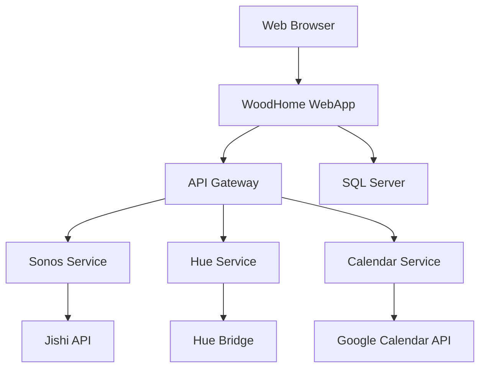

# WoodHome WebApp - Comprehensive Cleanup & Reorganization Implementation Guide

## Executive Summary

This guide provides a detailed, step-by-step implementation plan to transform the WoodHome WebApp from its current monolithic structure into a clean, maintainable, and scalable codebase. The current codebase has significant technical debt with a 1,500+ line main.go file, inconsistent organization, and missing best practices.

## Current State Analysis

### Critical Issues Identified

#### 1. **Monolithic Architecture**
- **main.go**: 1,500+ lines with mixed concerns
- **Database logic**: Embedded in main.go
- **Business logic**: Scattered throughout handlers
- **Configuration**: Hardcoded values and environment variables

#### 2. **Poor Code Organization**
- **Root directory clutter**: Multiple executable versions, config files mixed with code
- **Documentation scattered**: Implementation guides mixed with source code
- **No clear separation**: Frontend, backend, and documentation in same directories
- **Dead code**: Unused files and orphaned code

#### 3. **Missing Infrastructure**
- **No testing framework**: Only one test file exists
- **No configuration management**: Hardcoded values throughout
- **No error handling standards**: Inconsistent error management
- **No security measures**: Credentials in code, no input validation

#### 4. **Technical Debt**
- **19 TODO/FIXME items** across 9 files
- **No dependency injection**: Global variables and tight coupling
- **No logging standards**: Mixed logging approaches
- **No performance monitoring**: No metrics or profiling

## Implementation Plan

### Phase 1: Foundation Cleanup (Week 1-2)

#### 1.1 Directory Structure Reorganization

**Current Structure Issues:**
```
❌ Current (Problematic):
├── main.go (1,500+ lines)
├── woodhome-webapp*.exe (multiple versions)
├── ImplementationGuides/ (mixed with code)
├── ImplementationChecklists/ (mixed with code)
├── static/ (frontend mixed with backend)
├── internal/ (good structure but needs refinement)
└── node-sonos-http-api/ (external dependency in root)
```

**Target Structure:**
```
✅ Target (Clean):
├── cmd/
│   └── webapp/
│       └── main.go (refactored, <200 lines)
├── internal/
│   ├── config/
│   ├── database/
│   ├── handlers/
│   ├── middleware/
│   ├── models/
│   ├── services/
│   └── utils/
├── web/
│   ├── static/
│   ├── templates/
│   └── assets/
├── docs/
│   ├── api/
│   ├── architecture/
│   └── guides/
├── scripts/
├── tests/
│   ├── unit/
│   ├── integration/
│   └── e2e/
├── configs/
└── external/
    └── node-sonos-http-api/
```

**Implementation Steps:**

1. **Create new directory structure**
```bash
mkdir -p cmd/webapp
mkdir -p internal/{config,database,handlers,middleware,models,services,utils}
mkdir -p web/{static,templates,assets}
mkdir -p docs/{api,architecture,guides}
mkdir -p scripts
mkdir -p tests/{unit,integration,e2e}
mkdir -p configs
mkdir -p external
```

2. **Move files to appropriate locations**
```bash
# Move main.go
mv main.go cmd/webapp/

# Move documentation
mv ImplementationGuides/ docs/guides/
mv ImplementationChecklists/ docs/guides/

# Move web assets
mv static/ web/
mv templates/ web/

# Move external dependencies
mv node-sonos-http-api/ external/

# Move scripts
mv *.ps1 scripts/
mv *.bat scripts/
```

3. **Update import paths**
```go
// Update all Go files to use new import paths
// From: "woodhome-webapp/internal/handlers"
// To:   "woodhome-webapp/internal/handlers"
```

#### 1.2 Main.go Refactoring

**Current Issues:**
- 1,500+ lines in single file
- Mixed concerns (database, routing, business logic)
- Global variables and tight coupling
- No dependency injection

**Target Structure:**
```go
// cmd/webapp/main.go (new structure)
package main

import (
    "context"
    "log"
    "os"
    "os/signal"
    "syscall"
    
    "woodhome-webapp/internal/config"
    "woodhome-webapp/internal/database"
    "woodhome-webapp/internal/server"
)

func main() {
    // Load configuration
    cfg := config.Load()
    
    // Initialize database
    db := database.New(cfg.Database)
    defer db.Close()
    
    // Initialize services
    services := initializeServices(cfg, db)
    
    // Setup server
    srv := server.New(cfg.Server, services)
    
    // Start server with graceful shutdown
    startServer(srv)
}

func initializeServices(cfg *config.Config, db *database.DB) *Services {
    return &Services{
        Sonos:   services.NewSonosService(cfg.Sonos),
        Hue:     services.NewHueService(cfg.Hue),
        Calendar: services.NewCalendarService(cfg.Calendar),
        // ... other services
    }
}

func startServer(srv *server.Server) {
    // Graceful shutdown handling
    c := make(chan os.Signal, 1)
    signal.Notify(c, os.Interrupt, syscall.SIGTERM)
    
    go func() {
        <-c
        log.Println("Shutting down server...")
        srv.Shutdown()
    }()
    
    log.Printf("Starting server on %s", srv.Addr)
    if err := srv.ListenAndServe(); err != nil {
        log.Fatal(err)
    }
}
```

**Implementation Steps:**

1. **Extract configuration management**
```go
// internal/config/config.go
package config

import (
    "os"
    "strconv"
    "time"
)

type Config struct {
    Server   ServerConfig   `yaml:"server"`
    Database DatabaseConfig `yaml:"database"`
    Sonos    SonosConfig    `yaml:"sonos"`
    Hue      HueConfig      `yaml:"hue"`
    Calendar CalendarConfig `yaml:"calendar"`
    Email    EmailConfig    `yaml:"email"`
}

type ServerConfig struct {
    Port         string        `yaml:"port"`
    Host        string        `yaml:"host"`
    ReadTimeout  time.Duration `yaml:"read_timeout"`
    WriteTimeout time.Duration `yaml:"write_timeout"`
}

func Load() *Config {
    return &Config{
        Server: ServerConfig{
            Port:         getEnv("PORT", "3000"),
            Host:         getEnv("HOST", "localhost"),
            ReadTimeout:  getDuration("READ_TIMEOUT", 30*time.Second),
            WriteTimeout: getDuration("WRITE_TIMEOUT", 30*time.Second),
        },
        Database: DatabaseConfig{
            Host:     getEnv("DB_HOST", "localhost"),
            Port:     getEnv("DB_PORT", "1433"),
            Database: getEnv("DB_NAME", "woodhome"),
            Username: getEnv("DB_USER", ""),
            Password: getEnv("DB_PASSWORD", ""),
        },
        // ... other configs
    }
}
```

2. **Extract database layer**
```go
// internal/database/connection.go
package database

import (
    "database/sql"
    "fmt"
    
    _ "github.com/microsoft/go-mssqldb"
)

type DB struct {
    *sql.DB
    config DatabaseConfig
}

type DatabaseConfig struct {
    Host     string
    Port     string
    Database string
    Username string
    Password string
}

func New(config DatabaseConfig) (*DB, error) {
    connStr := fmt.Sprintf("server=%s;port=%s;database=%s;user id=%s;password=%s;trustservercertificate=true",
        config.Host, config.Port, config.Database, config.Username, config.Password)
    
    db, err := sql.Open("sqlserver", connStr)
    if err != nil {
        return nil, err
    }
    
    if err := db.Ping(); err != nil {
        return nil, err
    }
    
    return &DB{DB: db, config: config}, nil
}

func (db *DB) Close() error {
    return db.DB.Close()
}
```

3. **Extract server setup**
```go
// internal/server/server.go
package server

import (
    "context"
    "net/http"
    "time"
    
    "woodhome-webapp/internal/handlers"
    "woodhome-webapp/internal/middleware"
)

type Server struct {
    *http.Server
    handlers *handlers.Handlers
}

func New(cfg ServerConfig, services *Services) *Server {
    mux := setupRoutes(services)
    
    return &Server{
        Server: &http.Server{
            Addr:         cfg.Host + ":" + cfg.Port,
            Handler:      mux,
            ReadTimeout:  cfg.ReadTimeout,
            WriteTimeout: cfg.WriteTimeout,
        },
    }
}

func setupRoutes(services *Services) *http.ServeMux {
    mux := http.NewServeMux()
    
    // Add middleware
    mux.Handle("/", middleware.Logging(middleware.CORS(mainHandler)))
    
    // Add API routes
    api := handlers.NewAPI(services)
    mux.Handle("/api/", api)
    
    // Add static files
    mux.Handle("/static/", http.StripPrefix("/static/", http.FileServer(http.Dir("web/static/"))))
    
    return mux
}
```

#### 1.3 Dead Code Removal

**Files to Remove:**
```bash
# Remove executable files
rm -f woodhome-webapp*.exe
rm -f __debug_bin.exe*
rm -f test-build

# Remove unused CSS files
rm -f static/css/weather*.css
rm -f static/css/weather*.less

# Remove unused JS files
rm -f static/js/weather*.js
rm -f static/js/weather-sample.js

# Remove orphaned templates
rm -f templates/calendar.html
rm -f templates/candyland.html
rm -f templates/tictactoe.html
```

**Dependencies to Clean:**
```bash
# Remove unused Go dependencies
go mod tidy

# Remove unused Node.js dependencies
cd external/node-sonos-http-api
npm prune
```

### Phase 2: Architecture Improvements (Week 3-4)

#### 2.1 Configuration Management

**Current Issues:**
- Hardcoded configuration values
- No environment-specific configs
- Security credentials in code
- No configuration validation

**Implementation:**

1. **Create configuration system**
```go
// internal/config/config.go
package config

import (
    "fmt"
    "os"
    "strconv"
    "time"
    
    "gopkg.in/yaml.v3"
)

type Config struct {
    Environment string         `yaml:"environment"`
    Server      ServerConfig    `yaml:"server"`
    Database    DatabaseConfig `yaml:"database"`
    Services    ServicesConfig `yaml:"services"`
    Security    SecurityConfig `yaml:"security"`
}

type SecurityConfig struct {
    JWTSecret     string `yaml:"jwt_secret"`
    SessionSecret string `yaml:"session_secret"`
    CORSOrigins   []string `yaml:"cors_origins"`
}

func Load() (*Config, error) {
    env := getEnv("ENVIRONMENT", "development")
    
    config := &Config{
        Environment: env,
        Server: ServerConfig{
            Port:         getEnv("PORT", "3000"),
            Host:         getEnv("HOST", "localhost"),
            ReadTimeout:  getDuration("READ_TIMEOUT", 30*time.Second),
            WriteTimeout: getDuration("WRITE_TIMEOUT", 30*time.Second),
        },
        Database: DatabaseConfig{
            Host:     getEnv("DB_HOST", "localhost"),
            Port:     getEnv("DB_PORT", "1433"),
            Database: getEnv("DB_NAME", "woodhome"),
            Username: getEnv("DB_USER", ""),
            Password: getEnv("DB_PASSWORD", ""),
        },
        Security: SecurityConfig{
            JWTSecret:     getEnv("JWT_SECRET", ""),
            SessionSecret: getEnv("SESSION_SECRET", ""),
            CORSOrigins:   getStringSlice("CORS_ORIGINS", []string{"http://localhost:3000"}),
        },
    }
    
    // Validate configuration
    if err := config.Validate(); err != nil {
        return nil, fmt.Errorf("configuration validation failed: %w", err)
    }
    
    return config, nil
}

func (c *Config) Validate() error {
    if c.Server.Port == "" {
        return fmt.Errorf("server port is required")
    }
    if c.Database.Host == "" {
        return fmt.Errorf("database host is required")
    }
    if c.Security.JWTSecret == "" {
        return fmt.Errorf("JWT secret is required")
    }
    return nil
}
```

2. **Create environment-specific configs**
```yaml
# configs/development.yaml
environment: development
server:
  port: "3000"
  host: "localhost"
database:
  host: "localhost"
  port: "1433"
  database: "woodhome_dev"
services:
  sonos:
    jishi_url: "http://localhost:5005"
    timeout: "30s"
  hue:
    bridge_ip: ""
    username: ""
security:
  jwt_secret: "dev-secret-key"
  session_secret: "dev-session-secret"
```

```yaml
# configs/production.yaml
environment: production
server:
  port: "8080"
  host: "0.0.0.0"
database:
  host: "${DB_HOST}"
  port: "${DB_PORT}"
  database: "${DB_NAME}"
services:
  sonos:
    jishi_url: "${SONOS_JISHI_URL}"
    timeout: "30s"
security:
  jwt_secret: "${JWT_SECRET}"
  session_secret: "${SESSION_SECRET}"
```

#### 2.2 Error Handling Standardization

**Current Issues:**
- Inconsistent error handling patterns
- No centralized error management
- Poor error reporting
- No error logging standards

**Implementation:**

1. **Create standardized error types**
```go
// internal/utils/errors.go
package utils

import (
    "encoding/json"
    "fmt"
    "net/http"
)

type AppError struct {
    Code    string `json:"code"`
    Message string `json:"message"`
    Details string `json:"details,omitempty"`
    Status  int    `json:"-"`
}

func (e *AppError) Error() string {
    return e.Message
}

// Predefined error types
var (
    ErrNotFound     = &AppError{Code: "NOT_FOUND", Message: "Resource not found", Status: http.StatusNotFound}
    ErrUnauthorized = &AppError{Code: "UNAUTHORIZED", Message: "Unauthorized access", Status: http.StatusUnauthorized}
    ErrBadRequest   = &AppError{Code: "BAD_REQUEST", Message: "Invalid request", Status: http.StatusBadRequest}
    ErrInternal     = &AppError{Code: "INTERNAL_ERROR", Message: "Internal server error", Status: http.StatusInternalServerError}
)

func NewAppError(code, message string, status int) *AppError {
    return &AppError{
        Code:    code,
        Message: message,
        Status:  status,
    }
}

func HandleError(w http.ResponseWriter, err error) {
    var appErr *AppError
    if ae, ok := err.(*AppError); ok {
        appErr = ae
    } else {
        appErr = ErrInternal
        appErr.Details = err.Error()
    }
    
    w.Header().Set("Content-Type", "application/json")
    w.WriteHeader(appErr.Status)
    json.NewEncoder(w).Encode(appErr)
}
```

2. **Create error logging middleware**
```go
// internal/middleware/error.go
package middleware

import (
    "log"
    "net/http"
    "time"
    
    "woodhome-webapp/internal/utils"
)

func ErrorLogging(next http.Handler) http.Handler {
    return http.HandlerFunc(func(w http.ResponseWriter, r *http.Request) {
        start := time.Now()
        
        // Create response writer wrapper
        rw := &responseWriter{ResponseWriter: w, statusCode: http.StatusOK}
        
        // Call next handler
        next.ServeHTTP(rw, r)
        
        // Log error if status >= 400
        if rw.statusCode >= 400 {
            duration := time.Since(start)
            log.Printf("ERROR: %s %s - %d - %v - %s",
                r.Method, r.URL.Path, rw.statusCode, duration, r.RemoteAddr)
        }
    })
}

type responseWriter struct {
    http.ResponseWriter
    statusCode int
}

func (rw *responseWriter) WriteHeader(code int) {
    rw.statusCode = code
    rw.ResponseWriter.WriteHeader(code)
}
```

#### 2.3 Database Layer Improvements

**Current Issues:**
- SQL queries scattered throughout code
- No connection pooling configuration
- Missing database migrations
- No query builders

**Implementation:**

1. **Create database abstraction layer**
```go
// internal/database/repository.go
package database

import (
    "context"
    "database/sql"
    "fmt"
)

type Repository struct {
    db *DB
}

func NewRepository(db *DB) *Repository {
    return &Repository{db: db}
}

// Generic query methods
func (r *Repository) Query(ctx context.Context, query string, args ...interface{}) (*sql.Rows, error) {
    return r.db.QueryContext(ctx, query, args...)
}

func (r *Repository) QueryRow(ctx context.Context, query string, args ...interface{}) *sql.Row {
    return r.db.QueryRowContext(ctx, query, args...)
}

func (r *Repository) Exec(ctx context.Context, query string, args ...interface{}) (sql.Result, error) {
    return r.db.ExecContext(ctx, query, args...)
}

// Transaction support
func (r *Repository) WithTransaction(ctx context.Context, fn func(*sql.Tx) error) error {
    tx, err := r.db.BeginTx(ctx, nil)
    if err != nil {
        return err
    }
    
    defer func() {
        if p := recover(); p != nil {
            tx.Rollback()
            panic(p)
        } else if err != nil {
            tx.Rollback()
        } else {
            err = tx.Commit()
        }
    }()
    
    return fn(tx)
}
```

2. **Create migration system**
```go
// internal/database/migrations/migration.go
package migrations

import (
    "database/sql"
    "fmt"
    "log"
)

type Migration struct {
    Version string
    Up      string
    Down    string
}

var migrations = []Migration{
    {
        Version: "001_initial_schema",
        Up: `
            CREATE TABLE IF NOT EXISTS cribbage_games (
                id NVARCHAR(255) PRIMARY KEY,
                player1_email NVARCHAR(255) NOT NULL,
                player2_email NVARCHAR(255) NOT NULL,
                status NVARCHAR(50) DEFAULT 'waiting',
                player1_score INT DEFAULT 0,
                player2_score INT DEFAULT 0,
                current_phase NVARCHAR(50) DEFAULT 'waiting',
                current_player NVARCHAR(255),
                game_data NTEXT,
                created_at DATETIME2 DEFAULT GETDATE(),
                updated_at DATETIME2 DEFAULT GETDATE()
            );
        `,
        Down: `DROP TABLE IF EXISTS cribbage_games;`,
    },
    // ... more migrations
}

func RunMigrations(db *sql.DB) error {
    // Create migrations table
    if err := createMigrationsTable(db); err != nil {
        return err
    }
    
    // Get applied migrations
    applied, err := getAppliedMigrations(db)
    if err != nil {
        return err
    }
    
    // Apply pending migrations
    for _, migration := range migrations {
        if !applied[migration.Version] {
            log.Printf("Applying migration: %s", migration.Version)
            if err := applyMigration(db, migration); err != nil {
                return fmt.Errorf("failed to apply migration %s: %w", migration.Version, err)
            }
        }
    }
    
    return nil
}
```

### Phase 3: Code Quality & Testing (Week 5-6)

#### 3.1 Testing Infrastructure

**Current Issues:**
- Only one test file exists
- No integration tests
- No test coverage reporting
- No CI/CD pipeline

**Implementation:**

1. **Set up testing framework**
```go
// tests/setup.go
package tests

import (
    "database/sql"
    "testing"
    
    "woodhome-webapp/internal/config"
    "woodhome-webapp/internal/database"
)

func SetupTestDB(t *testing.T) *database.DB {
    cfg := &config.DatabaseConfig{
        Host:     "localhost",
        Port:     "1433",
        Database: "woodhome_test",
        Username: "test",
        Password: "test",
    }
    
    db, err := database.New(*cfg)
    if err != nil {
        t.Fatalf("Failed to connect to test database: %v", err)
    }
    
    // Run migrations
    if err := database.RunMigrations(db.DB); err != nil {
        t.Fatalf("Failed to run migrations: %v", err)
    }
    
    return db
}

func CleanupTestDB(t *testing.T, db *database.DB) {
    // Clean up test data
    db.Exec("DELETE FROM cribbage_games")
    db.Exec("DELETE FROM cribbage_game_tokens")
    db.Exec("DELETE FROM cribbage_game_moves")
    
    db.Close()
}
```

2. **Create unit tests**
```go
// tests/unit/services/sonos_test.go
package services

import (
    "context"
    "testing"
    
    "woodhome-webapp/internal/models"
    "woodhome-webapp/internal/services"
)

func TestSonosService_GetDevices(t *testing.T) {
    cfg := &models.SonosServiceConfig{
        JishiURL: "http://localhost:5005",
        Timeout:  5 * time.Second,
    }
    
    service := services.NewSonosService(cfg)
    
    devices, err := service.GetDevices()
    if err != nil {
        t.Fatalf("Failed to get devices: %v", err)
    }
    
    if len(devices) == 0 {
        t.Error("Expected at least one device")
    }
}
```

3. **Create integration tests**
```go
// tests/integration/api/sonos_test.go
package api

import (
    "net/http"
    "net/http/httptest"
    "testing"
    
    "woodhome-webapp/internal/handlers"
    "woodhome-webapp/internal/services"
)

func TestSonosAPI_GetDevices(t *testing.T) {
    // Setup test server
    service := services.NewSonosService(testConfig)
    handler := handlers.NewSonosHandler(service)
    
    req := httptest.NewRequest("GET", "/api/sonos/devices", nil)
    w := httptest.NewRecorder()
    
    handler.GetDevicesHandler(w, req)
    
    if w.Code != http.StatusOK {
        t.Errorf("Expected status 200, got %d", w.Code)
    }
    
    // Verify response structure
    var response map[string]interface{}
    if err := json.Unmarshal(w.Body.Bytes(), &response); err != nil {
        t.Fatalf("Failed to unmarshal response: %v", err)
    }
    
    if response["status"] != "success" {
        t.Errorf("Expected success status, got %v", response["status"])
    }
}
```

#### 3.2 Code Quality Tools

**Implementation:**

1. **Add Go linting**
```yaml
# .golangci.yml
linters-settings:
  gocyclo:
    min-complexity: 15
  goconst:
    min-len: 3
    min-occurrences: 3
  gocritic:
    enabled-tags:
      - diagnostic
      - experimental
      - opinionated
      - performance
      - style

linters:
  enable:
    - gocyclo
    - goconst
    - gocritic
    - gosec
    - govet
    - ineffassign
    - misspell
    - nakedret
    - prealloc
    - staticcheck
    - typecheck
    - unused
    - varcheck
    - whitespace

issues:
  exclude-rules:
    - path: _test\.go
      linters:
        - gocyclo
        - goconst
```

2. **Add pre-commit hooks**
```yaml
# .pre-commit-config.yaml
repos:
  - repo: https://github.com/pre-commit/pre-commit-hooks
    rev: v4.4.0
    hooks:
      - id: trailing-whitespace
      - id: end-of-file-fixer
      - id: check-yaml
      - id: check-added-large-files
      
  - repo: https://github.com/golangci/golangci-lint
    rev: v1.54.2
    hooks:
      - id: golangci-lint
        args: [--fix]
```

#### 3.3 Documentation

**Implementation:**

1. **Create API documentation**
```yaml
# docs/api/openapi.yaml
openapi: 3.0.0
info:
  title: WoodHome WebApp API
  version: 1.0.0
  description: API for WoodHome smart home automation system

paths:
  /api/sonos/devices:
    get:
      summary: Get Sonos devices
      responses:
        '200':
          description: List of Sonos devices
          content:
            application/json:
              schema:
                type: object
                properties:
                  status:
                    type: string
                    example: "success"
                  data:
                    type: array
                    items:
                      $ref: '#/components/schemas/SonosDevice'
  
  /api/hue/lights:
    get:
      summary: Get Hue lights
      responses:
        '200':
          description: List of Hue lights
          content:
            application/json:
              schema:
                type: object
                properties:
                  status:
                    type: string
                    example: "success"
                  data:
                    type: array
                    items:
                      $ref: '#/components/schemas/HueLight'

components:
  schemas:
    SonosDevice:
      type: object
      properties:
        uuid:
          type: string
        name:
          type: string
        room:
          type: string
        volume:
          type: integer
        is_online:
          type: boolean
```

2. **Create architecture documentation**
```markdown
# docs/architecture/system-design.md
# WoodHome System Architecture

## Overview
WoodHome is a modern home automation control center built with Go, featuring a web-based dashboard, game platform, and API infrastructure.

## Architecture Diagram


## Component Responsibilities

### Web Application Server
- Serves the main dashboard
- Handles API requests
- Manages WebSocket connections
- Provides static file serving

### Services Layer
- **Sonos Service**: Manages Sonos device discovery and control
- **Hue Service**: Controls Philips Hue lighting
- **Calendar Service**: Integrates with Google Calendar
- **Game Service**: Manages multiplayer games

### Database Layer
- **SQL Server**: Primary data store
- **Game State**: Cribbage game persistence
- **User Data**: Authentication and preferences
- **Device State**: Sonos and Hue device states
```

### Phase 4: Performance & Security (Week 7-8)

#### 4.1 Performance Optimization

**Implementation:**

1. **Implement response caching**
```go
// internal/middleware/cache.go
package middleware

import (
    "net/http"
    "time"
)

func CacheControl(duration time.Duration) func(http.Handler) http.Handler {
    return func(next http.Handler) http.Handler {
        return http.HandlerFunc(func(w http.ResponseWriter, r *http.Request) {
            w.Header().Set("Cache-Control", fmt.Sprintf("public, max-age=%d", int(duration.Seconds())))
            next.ServeHTTP(w, r)
        })
    }
}
```

2. **Add database query optimization**
```go
// internal/database/query_builder.go
package database

import (
    "fmt"
    "strings"
)

type QueryBuilder struct {
    table   string
    columns []string
    where   []string
    args    []interface{}
}

func NewQueryBuilder(table string) *QueryBuilder {
    return &QueryBuilder{table: table}
}

func (qb *QueryBuilder) Select(columns ...string) *QueryBuilder {
    qb.columns = columns
    return qb
}

func (qb *QueryBuilder) Where(condition string, args ...interface{}) *QueryBuilder {
    qb.where = append(qb.where, condition)
    qb.args = append(qb.args, args...)
    return qb
}

func (qb *QueryBuilder) Build() (string, []interface{}) {
    query := fmt.Sprintf("SELECT %s FROM %s", strings.Join(qb.columns, ", "), qb.table)
    
    if len(qb.where) > 0 {
        query += " WHERE " + strings.Join(qb.where, " AND ")
    }
    
    return query, qb.args
}
```

#### 4.2 Security Hardening

**Implementation:**

1. **Implement proper authentication**
```go
// internal/middleware/auth.go
package middleware

import (
    "net/http"
    "strings"
    
    "github.com/golang-jwt/jwt/v5"
)

func AuthMiddleware(jwtSecret string) func(http.Handler) http.Handler {
    return func(next http.Handler) http.Handler {
        return http.HandlerFunc(func(w http.ResponseWriter, r *http.Request) {
            token := extractToken(r)
            if token == "" {
                http.Error(w, "Unauthorized", http.StatusUnauthorized)
                return
            }
            
            claims, err := validateToken(token, jwtSecret)
            if err != nil {
                http.Error(w, "Invalid token", http.StatusUnauthorized)
                return
            }
            
            // Add user info to context
            ctx := context.WithValue(r.Context(), "user", claims)
            next.ServeHTTP(w, r.WithContext(ctx))
        })
    }
}

func extractToken(r *http.Request) string {
    auth := r.Header.Get("Authorization")
    if auth == "" {
        return ""
    }
    
    parts := strings.Split(auth, " ")
    if len(parts) != 2 || parts[0] != "Bearer" {
        return ""
    }
    
    return parts[1]
}
```

2. **Add input validation**
```go
// internal/utils/validation.go
package utils

import (
    "net/http"
    "regexp"
    "strings"
)

func ValidateEmail(email string) error {
    pattern := `^[a-zA-Z0-9._%+-]+@[a-zA-Z0-9.-]+\.[a-zA-Z]{2,}$`
    matched, err := regexp.MatchString(pattern, email)
    if err != nil {
        return err
    }
    if !matched {
        return fmt.Errorf("invalid email format")
    }
    return nil
}

func ValidateInput(w http.ResponseWriter, r *http.Request, rules map[string]func(string) error) error {
    for field, validator := range rules {
        value := r.FormValue(field)
        if err := validator(value); err != nil {
            http.Error(w, fmt.Sprintf("Invalid %s: %v", field, err), http.StatusBadRequest)
            return err
        }
    }
    return nil
}
```

### Phase 5: DevOps & Deployment (Week 9-10)

#### 5.1 Containerization

**Implementation:**

1. **Create Dockerfile**
```dockerfile
# Dockerfile
FROM golang:1.24-alpine AS builder

WORKDIR /app
COPY go.mod go.sum ./
RUN go mod download

COPY . .
RUN CGO_ENABLED=0 GOOS=linux go build -o webapp cmd/webapp/main.go

FROM alpine:latest
RUN apk --no-cache add ca-certificates
WORKDIR /root/

COPY --from=builder /app/webapp .
COPY --from=builder /app/web ./web
COPY --from=builder /app/configs ./configs

EXPOSE 3000
CMD ["./webapp"]
```

2. **Add docker-compose for development**
```yaml
# docker-compose.yml
version: '3.8'

services:
  webapp:
    build: .
    ports:
      - "3000:3000"
    environment:
      - ENVIRONMENT=development
      - DB_HOST=db
      - DB_PORT=1433
      - DB_NAME=woodhome_dev
    depends_on:
      - db
    volumes:
      - ./configs:/app/configs
      - ./web:/app/web

  db:
    image: mcr.microsoft.com/mssql/server:2022-latest
    environment:
      - ACCEPT_EULA=Y
      - SA_PASSWORD=YourStrong@Passw0rd
    ports:
      - "1433:1433"
    volumes:
      - db_data:/var/opt/mssql

volumes:
  db_data:
```

#### 5.2 CI/CD Pipeline

**Implementation:**

1. **Set up GitHub Actions**
```yaml
# .github/workflows/ci.yml
name: CI/CD Pipeline

on:
  push:
    branches: [ main, develop ]
  pull_request:
    branches: [ main ]

jobs:
  test:
    runs-on: ubuntu-latest
    
    steps:
    - uses: actions/checkout@v3
    
    - name: Set up Go
      uses: actions/setup-go@v3
      with:
        go-version: 1.24
    
    - name: Install dependencies
      run: go mod download
    
    - name: Run tests
      run: go test ./...
    
    - name: Run linter
      uses: golangci/golangci-lint-action@v3
      with:
        version: latest
    
    - name: Build
      run: go build -o webapp cmd/webapp/main.go
    
    - name: Security scan
      uses: securecodewarrior/github-action-add-sarif@v1
      with:
        sarif-file: security-scan-results.sarif

  deploy:
    needs: test
    runs-on: ubuntu-latest
    if: github.ref == 'refs/heads/main'
    
    steps:
    - uses: actions/checkout@v3
    
    - name: Deploy to production
      run: |
        echo "Deploying to production..."
        # Add deployment steps here
```

## Implementation Timeline

### Week 1-2: Foundation Cleanup
- [ ] Create new directory structure
- [ ] Move files to appropriate locations
- [ ] Refactor main.go (< 200 lines)
- [ ] Remove dead code and unused files
- [ ] Update import paths

### Week 3-4: Architecture Improvements
- [ ] Implement configuration management
- [ ] Standardize error handling
- [ ] Improve database layer
- [ ] Add dependency injection

### Week 5-6: Code Quality & Testing
- [ ] Set up testing framework
- [ ] Add unit and integration tests
- [ ] Implement code quality tools
- [ ] Create comprehensive documentation

### Week 7-8: Performance & Security
- [ ] Implement caching
- [ ] Add security measures
- [ ] Optimize database queries
- [ ] Add monitoring and logging

### Week 9-10: DevOps & Deployment
- [ ] Containerize application
- [ ] Set up CI/CD pipeline
- [ ] Implement deployment automation
- [ ] Add monitoring and alerting

## Success Metrics

### Code Quality Metrics
- [ ] Reduce main.go from 1,500+ lines to <200 lines
- [ ] Achieve 80%+ test coverage
- [ ] Zero critical security vulnerabilities
- [ ] All TODO/FIXME items addressed

### Performance Metrics
- [ ] Application startup time <5 seconds
- [ ] API response times <100ms
- [ ] Memory usage optimized
- [ ] Database query optimization

### Maintainability Metrics
- [ ] Clear separation of concerns
- [ ] Consistent error handling
- [ ] Comprehensive documentation
- [ ] Automated testing pipeline

## Risk Mitigation

### High-Risk Items
1. **Main.go refactoring** - Could break existing functionality
2. **Database changes** - Risk of data loss
3. **Configuration changes** - Could break deployment

### Mitigation Strategies
1. **Incremental refactoring** - Small, testable changes
2. **Comprehensive testing** - Before and after each change
3. **Backup strategies** - Database backups before changes
4. **Rollback plans** - Ability to revert changes quickly

This comprehensive implementation guide provides a detailed roadmap for transforming the WoodHome WebApp into a maintainable, scalable, and professional codebase that follows industry best practices.
